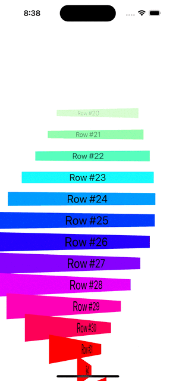

# 100 Days of SwiftUI Challenge

Welcome to my repository documenting my journey through the [100 Days of SwiftUI Challenge](https://www.hackingwithswift.com/100/swiftui). I chose this course as my starting point for my iOS development journey because it offers a rich collection of sample apps that progressively build your skills. Throughout this challenge, I built a series of SwiftUI projects that helped me explore animations, state management, and more, all of which have been instrumental in laying a strong foundation for my future endeavors in iOS development.

## Projects Overview

Below is an overview of each project including its title, purpose, and key features.

---

| Project Title                                | Purpose                                                                    | Key Features                                                                                          | Demo                                                                                   |
| -------------------------------------------- | -------------------------------------------------------------------------- | ----------------------------------------------------------------------------------------------------- | -------------------------------------------------------------------------------------- |
| **Project 1: [WeSplit]**                     | A tip calculator that helps split the bill among friends.                 | - Understanding the basic structure of a SwiftUI App   - Reading text from the user with TextField   - Creating Picker in a form            |                    |
| **Challenge 1: [UnitConverter]**                     | A temperature converter app.                 | - Creating a picker   - Using @State variable             |                    |
| **Project 2: [GuessTheFlag]**                | A quiz game to test your knowledge of world flags.                        | - Using stacks to arrange views   - Color, frames, gradients   - Buttons and iamges   -Showing alert messages                       |           |
| **Project 3: [ViewsAndModifiers]**           | Learn to create custom views and modifiers for reusable UI components.     | - Custom modifiers   - Reusable view components   - Clean, modular code design                   |  |
| **Milestone 1-3: [RockPaperScissors]**           | Rock Paper Scissors game where you should win or lose.     | |   |
| **Project 4: [BetterRest]**                  | Calculate your ideal bedtime based on personal sleep habits.               | - Selecting dates and times with DatePicker   - Connecting SwiftUI to Core ML |               |
| **Project 5: [WordScramble]**                | Challenge your vocabulary by unscrambling letters to form words.           | - Using List   - Validating words with UITextChecker                 |           |
| **Project 6: [Animation]**                   | Enhance user experience with smooth, interactive animations.               | - Implicit & explicit animations   - Gesture-driven effects   - Custom transitions               |                 |
| **Milestone 4-6: [TableLearner]**           | Learn multiplication tables through game.     | |   |
| **Project 7: [iExpense]**                    | Track and manage your expenses in a simple, organized way.                 | - Sharing SwiftUI state with @Observable   - Deleting items with onDelete()   - Storing user setting with UserDefaults   - Archiving Swift objects with Codable               |                   |
| **Project 8: [Moonshot]**                    | Explore NASA’s missions with interactive data and imagery.        | - Resizing images to fit the available space   - Using ScrollView   - Pushing new views on the stack using NavigationLink   - Working with hierarchical Codable data            |                   |
| **Project 9: [Navigation]**                  | Demonstrate advanced navigation techniques in SwiftUI.                   | - Navigating to different data types using NavigationPath   - Making NavigationStack return to its root view programmatically   - Saving NavigationStack paths using Codable             | |
| **Milestone 7-9: [HabitTracker]**           | Track your habit for different activities.     | |   |
| **Project 10: [CupcakeCorner]**              | Place cupcake orders with a fun, interactive ordering interface.           | - Sending and receiving Codable data with URLSession and SwiftUI   - Loading an image from a remote server   - Validating and disabling forms   -Adding haptic effects      |        |
| **Project 11: [Bookworm]**                   | Manage your personal library with Core Data for efficient book tracking.   | - Using @Binding custom component   - Accepting multi-line text input with TextEditor   - Introduction to SwiftData   - Building a list with @Query                                |                  |
| **Project 12: [SwiftData]**                  | Experiment with modern data management using SwiftData.                    | - Editing SwiftData model objects   - Filtering @Query using Predicate   - Suncing SwiftData with CloudKit                | |
| **Milestone 10-12: [InternetInformation]**           | Download some information about friends from Internet.     | |   |
| **Project 13: [Instafilter]**                | Apply filters to images for fun and artistic effects.             | - Responding to stage changes using onChange()   - Showing multiple options with confirmationDialog()   - Integrating Core Image with SwiftUI   - Showing empty states with ContentUnavailableView    - Loading photos from the user's photo library   - Letting the user share content with ShareLink    - Asking the user to leave an App Store review       |            |
| **Project 14: [BucketList]**                 | Keep track of places in a visually appealing app.     | - Adding conformance to Comparable for custom types   - Writing data to the documents directory   - Switching view states with enums   - Integrating MapKit with SwiftUI   - Using TouchID and FaceID with SwiftUI   - Downloading data from Wikipedia   - Introducing MVVM into the project                         |              |
| **Project 15: [AccessibilitySandbox]**       | Experiment with accessibility features to build more inclusive apps.       | - Identifying views with useful labels   - Hiding and grouping accessibility data                | |
| **Milestone 13-15: [PhotoCollection]**           | Create a collection of photos with descriptions.     | |   |
| **Project 16: [HotProspects]**               | Manage and track people met during an event.                | - Letting users select items in a List   - Creating tabs with TabView and tabItem()   - Generating and scaling up a QR Code   - Adding options with a swipe actions    - Adding a context menu to an image   - Posting notifications to the lock screen                |          |
| **Project 17: [Flashzilla]**                 | Enhance learning with a flashcard app for quick reviews and memorization.  | - Disabling user interactivity with allowsHitTesting()   - Triggering events repeatedly using a timer   - Adding scenePhase environment value to be notified when the app moves to the background                   |              |
| **Project 18: [LayoutAndGeometry]**          | Master advanced layouts and geometry techniques in SwiftUI.              | - GeometryReader usage   - Alignment and alignment guides   - Absolute positioning for SwiftUI views   -ScrollView effects using GeometryReader, visualEffect() and scrollTargetBehavior()                  | |
| **Milestone 16-18: [Dice]**           | Throw multiple dice at the same time and calculate the total.     | |   |
| **Project 19: [SnowSeeker]**                 | Discover ski resorts with detailed resort profiles.             | - Making app better on iPad using NavigationSplitView   - Searchable resort list   - Changing a view's layout in response to size classes                |              |

        

---

## Final Thoughts

This challenge was an incredible learning experience that deepened my understanding of SwiftUI. I look forward to applying these skills in future projects and continuing my journey in iOS development.

Feel free to explore the projects and share any feedback or suggestions!
